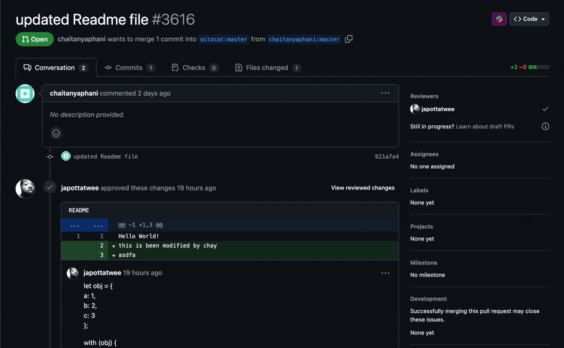

# GitHub PR to Slack

This extension adds a convenient "Send to Slack" button to GitHub pull request pages, allowing you to quickly share PR information with your team.



## Table of Contents

- [Key Features](#key-features)
- [How It Works](#how-it-works)
- [Installation](#installation)
- [Setup](#setup)
- [Usage](#usage)
- [Privacy & Security](#privacy--security)
- [Use Cases](#use-cases)
- [Troubleshooting](#troubleshooting)
- [Development](#development)
- [Contributing](#contributing)
- [License](#license)
- [Roadmap](#roadmap)

## Key Features

- One-click sharing of GitHub PRs to any Slack channel
- Manage multiple Slack webhooks side-by-side and pick a destination from a dropdown at send time
- Works with both GitHub.com and GitHub Enterprise installations
- Customizable messages to add context when sharing PRs
- Remembers the last webhook you used for faster sharing
- Clean, intuitive interface that integrates seamlessly with GitHub's design
- Comprehensive PR information including title, URL, reviewers, and code changes
- Dark mode support that matches your GitHub theme preference

## How It Works

1. Navigate to any GitHub pull request page
2. Enable the extension by clicking the icon in your browser toolbar
3. Click the "Send to Slack" button that appears in the PR header
4. Pick the webhook you want to post to and tweak the default message if needed
5. Click "Send" to instantly share the PR with your team

## Installation

### From Chrome Web Store

1. Visit the [GitHub PR to Slack](https://chromewebstore.google.com/detail/send-pr-to-slack/jplkdpbembjnkfffcfjjihiboldoneef) extension page in the Chrome Web Store
2. Click "Add to Chrome" to install the extension
3. The extension will be automatically installed and ready to use

### Development Mode

1. Clone this repository
2. Open Chrome and navigate to `chrome://extensions/`
3. Enable "Developer mode" in the top-right corner
4. Click "Load unpacked" and select the `dist` directory
5. The extension should now be installed and active

## Setup

Before using the extension, you'll need to add at least one Slack webhook in the options page:

1. Click the extension icon in your browser toolbar
2. Select "Options"
3. Under "Slack Webhooks", enter a short **name** (used as the label in the popup's dropdown) and the **webhook URL** for that channel
4. Click "Add webhook" to add more destinations — each webhook posts to the channel it was created for in Slack
5. Optionally configure a GitHub Enterprise domain

Settings auto-save as you type; validation errors appear inline.

> **Important**: Due to Chrome's security model and the extension's use of the `activeTab` permission, you must click on the extension icon at least once after installation to grant it permission to access GitHub pages. This is required for the "Send to Slack" button to appear on PR pages.

### Getting a Slack Webhook URL

1. Go to your [Slack API Apps page](https://api.slack.com/apps)
2. Click "Create New App" and select "From scratch"
3. Name your app and select your workspace
4. Navigate to "Incoming Webhooks" in the sidebar
5. Toggle "Activate Incoming Webhooks" to On
6. Click "Add New Webhook to Workspace"
7. Select the channel the webhook should post to — each webhook is bound to one channel
8. Copy the Webhook URL and add it as a new entry in the extension options, giving it a recognizable name (e.g. `#frontend`, `#releases`)

## Privacy & Security

- Your Slack credentials are stored locally in your browser using Chrome's secure storage API
- No data is sent to any third-party servers
- The extension only requests permissions necessary for its functionality:
  - `activeTab`: To interact with GitHub PR pages
  - `storage`: To save your preferences and webhook URLs
  - `scripting`: To inject the "Send to Slack" button
- All communication with Slack happens directly from your browser
- The extension does not track your browsing activity

## Use Cases

- Notify team members when a PR is ready for review
- Integrate GitHub activities into your team's Slack communication

Perfect for developers, QA engineers, and technical teams who use both GitHub and Slack in their workflow.

## Troubleshooting

### Common Issues

**The "Send to Slack" button doesn't appear**

- Make sure you're on a GitHub pull request page
- Try refreshing the page
- Check if the extension is enabled in Chrome's extension manager
- Click on the extension icon in your toolbar at least once to grant the `activeTab` permission

**Error sending to Slack**

- Verify the selected webhook's URL is correct in the extension options
- Check your internet connection
- Ensure your Slack workspace allows incoming webhooks
- If a webhook was deleted in Slack, remove or replace it in the extension options
- Check if your Slack app has the necessary permissions

**GitHub Enterprise not working**

- Make sure you've entered the correct domain in the extension options
- Verify that your GitHub Enterprise instance is accessible from your browser
- Ensure you've clicked the extension icon at least once while on your GitHub Enterprise domain

**Extension icon appears disabled**

- This is normal when you're not on a GitHub PR page
- The icon will be enabled when you navigate to a supported page

## Development

### Setup

1. Clone this repository
2. Run `npm install` to install dependencies
3. Run `npm run dev` to start the development server

### Building

Run `npm run build` to build the extension for production.

### Testing

This project uses Vitest for testing. The test suite includes unit tests, integration tests, and coverage reporting.

#### Test Commands

- `npm test` - Run all tests
- `npm run test:fast` - Run all tests without type checking (faster)
- `npm run test:coverage` - Run tests with coverage reporting
- `npm run test:ui` - Run tests with the Vitest UI
- `npm run test:ci` - Run tests in CI mode with coverage and verbose reporting

### Project Structure

```
├── icons/                  # Extension icons
├── manifest.json           # Extension configuration
├── src/
│   ├── background          # Background script
│   ├── pages/              # Main application pages
│   │   ├── content/        # Content scripts
│   │   └── options/        # Options page
│   ├── components/         # Reusable UI components
│   ├── utils/              # Utility functions
│   ├── hooks/              # Custom React hooks
│   ├── test/               # Test infrastructure
│   │   ├── mocks/          # Mock implementations
│   │   ├── fixtures/       # Test data
│   │   └── utils/          # Testing utilities
│   └── types/              # TypeScript type definitions
└── dist/                   # Built extension (generated)
```

## Contributing

Contributions are welcome! Please read our [Contributing Guide](CONTRIBUTING.md) for details on our code of conduct and the process for submitting pull requests.

## License

This project is licensed under the MIT License - see the [LICENSE](LICENSE) file for details.

## Roadmap

Possible future extensions include:

- Firefox browser support
- Customizable PR message templates
- Integration with more Slack features (threads, reactions)
- Support for other messaging platforms
- Localization support for multiple languages
